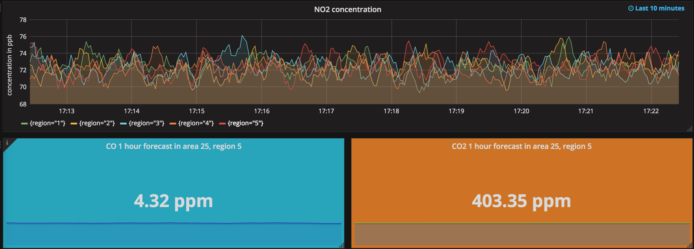

# AirQ - monitoring air quality in real time.

Air pollution is a serious issue in some areas in many places around the world, or at critical time periods. The goal of my project is to build a platform to connect simulated air quality sensors, collect sensor data, and monitor the air quality in real time. The technology I chose to explore is [Prometheus](https://prometheus.io), which is a monitor system and time series database.

* [Presentation Slides](https://docs.google.com/presentation/d/1CZ3yTWvKGmZ99p0HzRzDFpIKr_uWzRXe25seC-otXlw/edit?usp=sharing)

* [Live Demo](http://ec2-52-33-228-61.us-west-2.compute.amazonaws.com:3000/dashboard/db/airq_demo_prom1?refresh=1m&orgId=1&from=1506646536925&to=1506646836926)

* [Record](https://youtu.be/8xptR4viCOs)

<p align="center">

</p>


## Design

Sensor applications produce simulated data, and expose those data to a __collector server__ (sub-level Prometheus server) via http endpoints using prometheus-cpp client library. The collector server periodically pulls all sensor metrics from each sensor. As the number of sensors increases, more collector servers (Prometheus servers) may be added, where each server will scrape a subset of the  targets. An __aggregation server__ (global Prometheus server) then collects the aggregated data from these collector servers. Data visualization is handled by Grafana.

<p align="center">

</p>

### Data flow in detail

1. A producer is setup to generate multiple http servers which simulate the endpoints of sensor devices, and send target (sensor) information to a register server between the producer and collector server.
2. The register server (now on the same node as the collector server) is set up to receive target information, and generate a JSON file that contains the information of sensors.
3. Collector server(s) takes JSON files, and scrape targets with a specified interval (e.g. 10s).
4. A Grafana server is set up to display data from collector/aggregation server(s).


### Data format
1. Metric data exposed to a collector server

   `metric_name{key_1=value_1,key_2=value_2, ...} number`

2. Scraping targets in JSON file of a collector server

   For example, `{"labels": {"job": "job_name"}, "targets": ["URL:port_number"]}`

3. Recording rules in PromQL

   For example, `avg(metric_name) by (key_1)`


## Dependence
This program requires:
* [Prometheus](https://prometheus.io) - a monitor system and time series database.
* A C++ compiler that supports the C++11 standard. This application has been tested with Apple Clang version 8.1.0 and GCC versions 6.3.0.
* [prometheus-cpp](https://github.com/jupp0r/prometheus-cpp) - Prometheus client library in C++. The installation instruction is included in the `README` file under the _airq_sensor_ directory.
* [Protocol Buffers](https://github.com/google/protobuf) - Google's data interchange format. It is needed to compile prometheus-cpp. See the `README` file in _airq_sensor_ directory for compilation and installation.
* [Grafana](https://grafana.com) - a platform for analytics and monitoring.
* libcurl4-openssl-dev - a client-side URL transfer library.

## Build

### Collector server 

See instructions in the `README` file under the _servers_ directory.


### Producer (sensor simulation)

1. Follow instructions in the `README` file under the _airq_sensor_ directory to install prerequisites which include gcc-6, protobuf, prometheus-cpp, et al.

2. Build __producer__ following the `Build airq_sensor` section in the `README` file in the _airq_sensor_ directory.

## Run

1. Set up a __register server__ to receive target information

   In the _prometheus_ source directory, run 

  ```
  ./sensor_registry_server.py [targets.json] [port number = 8080]
  ```
  * For example, `./sensor_registry_servers.py targets.json`. Example of target JSON files can be found under _servers/example_json_.

2. Send target infomation to the __register server__

   Copy `spawn_sensors.sh` under the _airq_sensor_ directory to the build directory of airq_sensor, run

```
./spawn_sensors.sh [start of port number] [end of port number] [sensor label]
```
   * For example, `./spawn_sensors.sh 2000 20002 A`

3. Modify the `sensor-server.yml` in the _prometheus_ source directory to match the names of the JSON files that contain target information.

4. Start a __collector server(s)__

   In the _prometheus_ source directory, run

```
./run_servers.sh
```

5. Start an __aggregation server__

   In _/prometheus/run_servers.sh_, change `config.file` parameter to `prometheus-servers.yml`, and run 

```
./run_servers.sh
```

## License

#### 1. [Prometheus](https://github.com/prometheus/prometheus) 
Apache License 2.0

#### 2. [prometheus-cpp](https://github.com/jupp0r/prometheus-cpp)
MIT

#### 3. protobuf
[LICENSE](https://github.com/google/protobuf/blob/master/LICENSE)

#### 4. [Grafana](https://github.com/grafana/grafana)
Apache License 2.0

