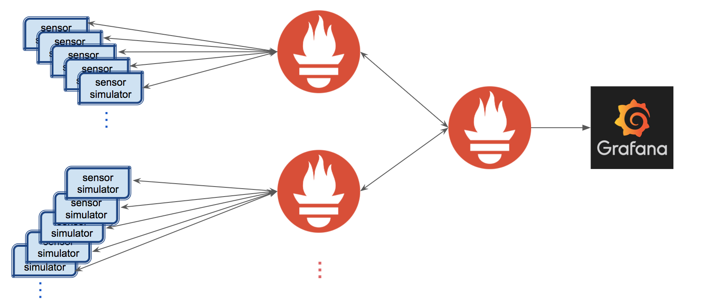

# AirQ 
 Monitoring air quality in real time.

## Design

Sensor data are simulated and exposed to the Prometheus server via http endpoints with prometheus-cpp client library. The Prometheus server goes and reads all the metric data for a sensor periodically. As the number of sensors increase, more Prometheus servers with recording rules can be set up to scrape different targets. A global Prometheus server then can pull the aggregated data from sub-level servers. The data visualization is through Grafana. 

<p align="center">

</p>

## Dependence
This program requires:
* [Prometheus]("https://prometheus.io") - a monitor system and time series database
* a C++ comiplier that supports the C++11 standard. This application has been tested with Apple Clang version 8.1.0, and GCC versions 6.3.0.
* [prometheus-cpp]("https://github.com/jupp0r/prometheus-cpp") - Prometheus client library in C++. The installation instruction is included in the `sensor_simulation` directory.
* [Protocol Buffers]("https://github.com/google/protobuf") - Google's data interchange format required by prometheus-cpp. See the `README` file in `sensor_simulation` directory for compilation and installation.

## Build

### Set up Prometheus server 

1. Download Prometheus

```
wget https://github.com/prometheus/prometheus/releases/download/v1.7.1/prometheus-1.7.1.linux-amd64.tar.gz
tar xvfz prometheus-1.7.1.linux-amd64.tar.gz
mv prometheus-1.7.1.linux-amd64.tar.gz prometheus
```

2. Copy everything in `prometheus_setup` direcoty into `prometheus` source directory


### Set up sensor data simulation

1. Follow the instruction in the `README` file in the `sensor_simulation` directory to install prerequisites which include gcc-6, protobuf, prometheus-cpp.

2. Build sensor_simulation following the `Build sensor_simulation` section in in the `README` file in the `sensor_simulation` directory.

## Run

1. Set up an intermediate server to receive target information

In the `prometheus` source directory, run 

```
./generate_prom_targets.py [targets.json] [port number = 8080]
```
For example, `./generate_prom_targets.py targets.json`. Example of target json files can be found under `prometheus_setup/example_json`.

2. Send target infomation to the intermediate server

Copy `generate_ports.sh` under the `sensor_simulation` directory to the build directory of sensor_simulation, run

```
./generate_ports.sh [start of port number] [end of port number] [sensor label]
```
For example, `./generate_ports.sh 2000 20002 A`

3. Modify the `sensor-server.yml` to match the names of the json files that contain target information.

4. Run the Prometheus server

```
./run_prom.sh
```


