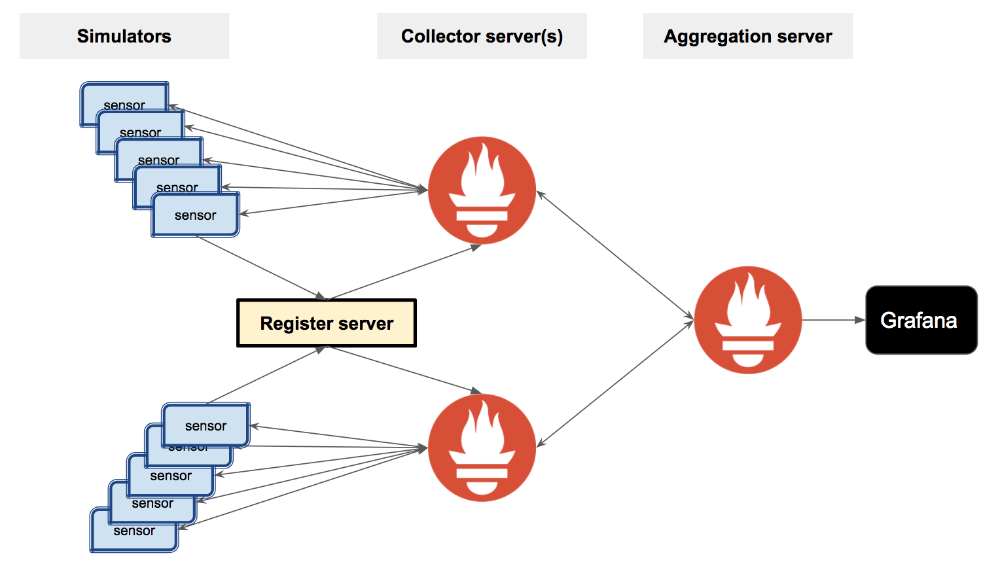

# AirQ - monitoring air quality in real time.

Air pollution can be serious issue in some areas or critical time periods. The goal of my project is to build a platform to connect air quality sensors, collect data, and monitor the air quality in real time. The techonoly I chose to explore is [Prometheus](https://prometheus.io), which is a monitor system and time series database. 

## Design

Sensor data are simulated and exposed to the Prometheus server via http endpoints using prometheus-cpp client library. The Prometheus server pulls all the metric data for every sensor periodically. As the number of sensors increases, more Prometheus servers with recording rules can be set up to scrape different targets. A global Prometheus server then can collect the aggregated data from sub-level servers. The data visualization is done through Grafana. 

<p align="center">

</p>

### Data flow for one producer and one Prometheus server

1. A producer is set up to generate multiple http servers which simulate the endpoits of sensor devices, and send target (sensor) information to an intermediate server between producer and Prometheus server.
2. An intermediate server (now on the same node as the Prometheus server) is set up to receive target information, and generate a JSON file that contains the information of sensors.
3. Prometheus server takes JSON files, and scrape targets with a specified interval (e.g. 10s)
4. A Grafana server is set up to display data from Prometheus.

<p align="center">

</p>

### Data format
1. Metric data exposed to Prometheus

`metric_name{key_1=value_1,key_2=value_2, ...} number`
2. Scraping targets in JSON file of Prometheus

For example, `{"labels": {"job": "job_name"}, "targets": ["URL:port_number"]}`

3. Recording rules in PromQL

For example, `avg(metric_name) by (key_1)`


## Dependence
This program requires:
* [Prometheus](https://prometheus.io) - a monitor system and time series database
* A C++ comiplier that supports the C++11 standard. This application has been tested with Apple Clang version 8.1.0, and GCC versions 6.3.0.
* [prometheus-cpp](https://github.com/jupp0r/prometheus-cpp) - Prometheus client library in C++. The installation instruction is included in the `README` file under the _sensor_simulation_ directory.
* [Protocol Buffers](https://github.com/google/protobuf) - Google's data interchange format. It is needed to compile prometheus-cpp. See the `README` file in _sensor_simulation_ directory for compilation and installation.
* [Grafana](https://grafana.com) - a platform for analytics and monitoring.

## Build

### Set up Prometheus server 

1. Download Prometheus

```
wget https://github.com/prometheus/prometheus/releases/download/v1.7.1/prometheus-1.7.1.linux-amd64.tar.gz
tar xvfz prometheus-1.7.1.linux-amd64.tar.gz
# rename prometheus source directory
mv prometheus-1.7.1.linux-amd64.tar.gz prometheus
```

2. Copy everything in the _prometheus_setup_ direcoty into the _prometheus_ source directory


### Set up sensor data simulation

1. Follow instructions in the `README` file under the _sensor_simulation_ directory to install prerequisites which include gcc-6, protobuf, prometheus-cpp, et al.

2. Build sensor_simulation following the __Build sensor_simulation__ section in in the `README` file in the _sensor_simulation_ directory.

## Run

### Sub-level Prometheus server

1. Set up an intermediate server to receive target information

In the _prometheus_ source directory, run 

```
./generate_prom_targets.py [targets.json] [port number = 8080]
```
For example, `./generate_prom_targets.py targets.json`. Example of target JSON files can be found under _prometheus_setup/example_json_.

2. Send target infomation to the intermediate server

Copy `generate_ports.sh` under the _sensor_simulation_ directory to the build directory of sensor_simulation, run

```
./generate_ports.sh [start of port number] [end of port number] [sensor label]
```
For example, `./generate_ports.sh 2000 20002 A`

3. Modify the `sensor-server.yml` in the _prometheus_ source directoryto match the names of the JSON files that contain target information.

4. Run the Prometheus server

In the _prometheus_ source directory, run

```
./run_prom.sh
```

### Global Prometheus server

In _/prometheus/run_prom.sh_, change `config.file` parameter to `prometheus-servers.yml`, and run 

```
./run_prom.sh
```

## License

#### 1. [Prometheus](https://github.com/prometheus/prometheus) 
Apache License 2.0

#### 2. [prometheus-cpp](https://github.com/jupp0r/prometheus-cpp)
MIT

#### 3. protobuf
[LICENSE](https://github.com/google/protobuf/blob/master/LICENSE)

#### 4. [Grafana](https://github.com/grafana/grafana)
Apache License 2.0

